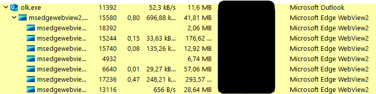
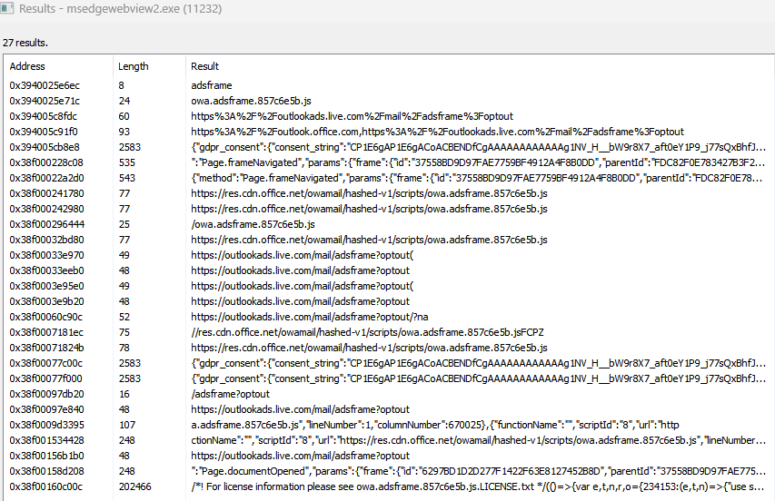

# Outlook desktop Reverse engeenering

The aim of this project is to reverse engineer the Outlook desktop app to find a way to block the ads. This is a work in progress, so don't expect anything. I am in no way experienced in reverse engineering, so if you have any tips, please let me know.

---

## Table of Contents

- [FAQ](#faq)
- [Current findings](#current-findings)
  - [URL based loading](#url-based-loading)
  - [Background threads](#background-threads)
    - [MS WebView2](#what-does-the-microsoft-edge-webview2-do)
    - [Optout string](#optout-string)
- [Current Approaches](#current-approaches)
  - [URL based blocking](#url-based-blocking)
  - [Background thread blocking](#background-thread-blocking)
- [Suggestions](#suggestions)
- [Project files](#project-files)
- [Contributing](#contributing)
- [Disclaimer](#disclaimer)

---

# FAQ

- **Q:** Why?

    A: I like outlook. I use it a lot, personally and for work. I don't like ads. I want to block them. Also I want to learn more about reverse engineering.

- **Q:** What is the goal of this project?

    A: To find a way to block the ads in the Outlook desktop app, without breaking the app and removing the blank space where the ads would be.

- **Q:** What tools are you using?

    A: I am using [Process Hacker](https://processhacker.sourceforge.io/) to view the threads and [Ghidra](https://ghidra-sre.org/) to reverse engineer the app.

---

## Current findings

### URL based loading

- Ads are loaded from `https://outlookads.live.com/`

### Background threads

When the app is opened, everything is rendered using the [Microsoft Edge WebView2](https://developer.microsoft.com/en-us/microsoft-edge/webview2/) (`msedgewebview2.exe`) with the render ID's 1-6. The ads are rendered in the render ID 7. This thread gets created when switching to the tab containing the ads.



#### What does the Microsoft Edge WebView2 do?

```text
"The Microsoft Edge WebView2 control allows you to embed web technologies (HTML, CSS, and JavaScript) in your native apps. The WebView2 control uses Microsoft Edge as the rendering engine to display the web content in native apps."
```

For us, this means that the ads loaded in some way of HTML, CSS or JavaScript. After checking the filesystem, I couldn't find any files that loaded the ads. This means that the ads are probably loaded from the internet. But things get more interesting when checking the strings loaded into the memory of the `msedgewebview2.exe` process, with the render ID 7.



Here we can see the string `adsframe` repeated again and agains, as well as the [MS office CDN link](https://res.cdn.office.net/owamail/hashed-v1/scripts/owa.adsframe.857c6e5b.js) to the javascript file responsible for loading the ads. Check out [adsframe.js](./adsframe.js) for a beautified version of the file.

While this is very important, I haven't found anything too interesting in the 30K lines of code.

But what could be very important is the last memory address `0x38f00160c00c`. At this address we can see the beginning of the entire `adsframe.js` file. That means that the code is loaded into the memory somewhere around there.

#### Optout string

Also interesting is the `optout` string. This probably means that there is a way to opt out of the ads, but I couldn't figure out what the needed payload is. When accessing the site directly, it just loops the outlook startup animation, without anything else happening.

#### Important arguments

- `--renderer-client-id=7`
- `--webview-exe-name=olk.exe`

#### Important functions

- None found (yet)

---

## Current Approaches

Here are some approaches that I've tried, but didn't work out to the extend that I wanted them to.

### URL based blocking

- Blocking the URL in the hosts file. This works, but still leaves a blank space where the ads would be. See [this](https://github.com/Pyenb/Outlook-desktop-ad-blocker/) repo for more info.

### Background thread blocking

- Pausing the render ID 7 thread. This works, but also leaves the blank space behind. See [barblock.py](./barblock.py) for a PoC.

- Killing the render ID 7 thread. Sadly, this also kills the whole app, making it unusable.

---

## Suggestions

Here are some suggestions, that I got from other people (mostly [Discord](https://discord.com/channels/391398885819547652/1200216320839524372)). I haven't tried them yet, but I will in the future. Feel free to suggest more!

- Find the function that loads the `adsframe.js` and make it return nothing or point it to a custom server that returns a blank javascript file.

---

## Project files

In this repo included is my current Ghidra project file. This contains the older `OUTLOOK.EXE`, which is the base outlook with most of the features and the newer `OLK.EXE`, which is the new UI with the ads.

ALso included is the `barblock.py` file, which is a PoC for the background thread blocking approach.

---

## Contributing

Pull requests are *VERY* welcome. I am not experienced in reverse engineering, so any help is appreciated. For major changes, please open an issue first to discuss what you would like to change.

[](https://www.gnu.org/licenses/gpl-3.0)

## Disclaimer

This repository is for research purposes only, the use of this code is your responsibility.

I take NO responsibility and/or liability for how you choose to use any of the source code available here. By using any of the files available in this repository, you understand that you are AGREEING TO USE AT YOUR OWN RISK. Once again, ALL files available here are for EDUCATION and/or RESEARCH purposes ONLY.
